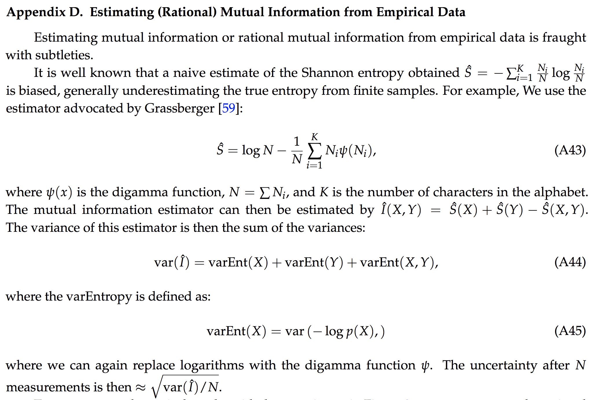
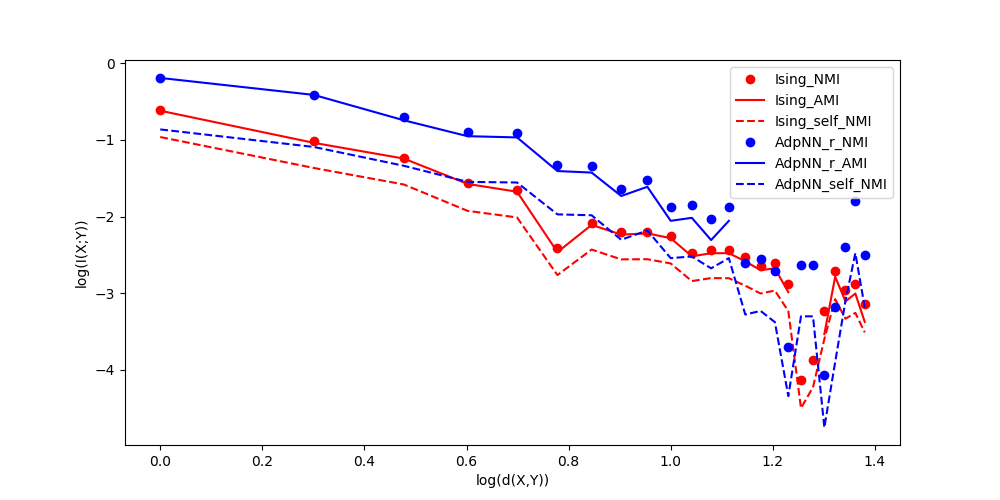

# The calculation of Mutual Info

It's not a trivial thing.
[Binning matters.](http://scikit-learn.org/stable/auto_examples/cluster/plot_adjusted_for_chance_measures.html#sphx-glr-auto-examples-cluster-plot-adjusted-for-chance-measures-py)

### how to correctly modify calculation of entropy?

### scikit-learn

scikit-learn has 3 methods to calculate mutual entropy.

1. Adjusted_MI
2. Normalized_MI: I(X;Y)/sqrt(H(X)H(Y)) (I wrote the same one by myself.)
3. MI
Below is a simple case for discrete integer data

### how to bin properly? k-mean clustering?

$MI(U,V)=\sum_{i=1}^{|U|} \sum_{j=1}^{|V|} \\frac{|U_i\cap V_j|}{N}
        \log\\frac{N|U_i \cap V_j|}{|U_i||V_j|}$
