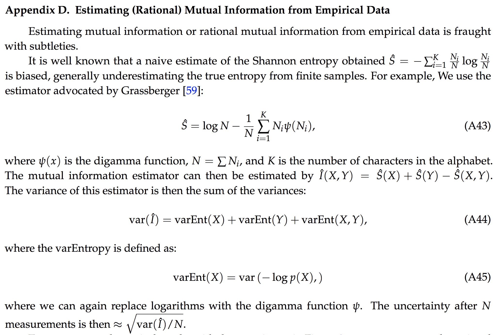
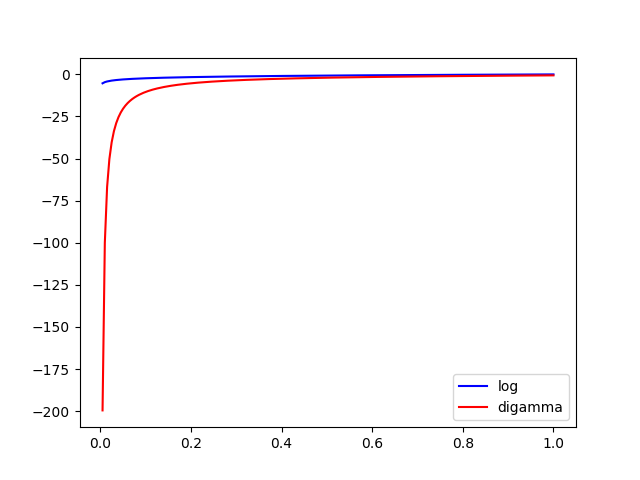
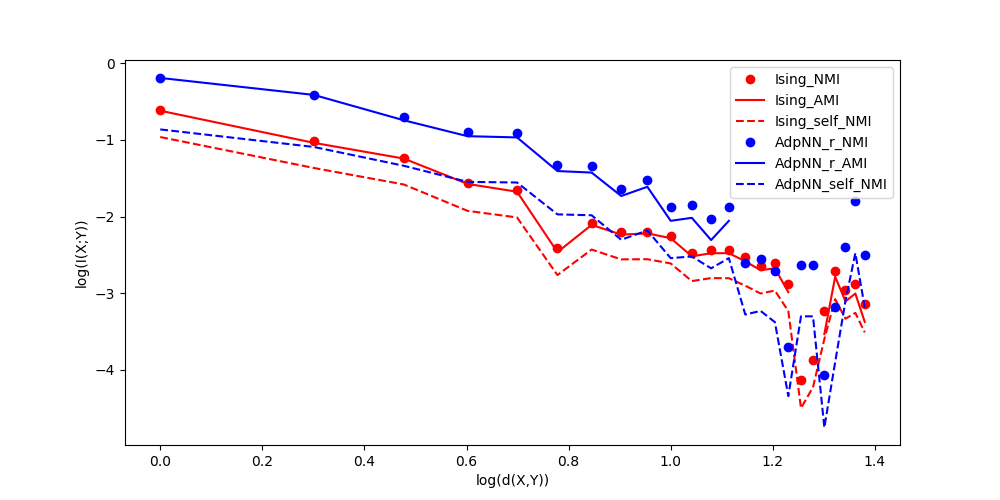

# The calculation of Mutual Info

It's anything but trivial, and occupied my whole week.

## [Binning matters.](http://scikit-learn.org/stable/auto_examples/cluster/plot_adjusted_for_chance_measures.html#sphx-glr-auto-examples-cluster-plot-adjusted-for-chance-measures-py)
Note the [V-measure](http://scikit-learn.org/stable/modules/generated/sklearn.metrics.v_measure_score.html) here is identical to normalized_MI.

**Cluster samples of your X, Y and label them**

## how to do correction when calculating entropy?
If you want var(I), have a look at the figure below.

If we think of Ni in each bin as possion distribution with mean the real pi*N we want, then below is a statistical correction, especially when your bin size is small and the number of your total samples is large.

Note that digamma(x) differs from log(x) only when x is smaller than 0.4.

## scikit-learn [Source Code](https://github.com/scikit-learn/scikit-learn/blob/a24c8b46/sklearn/metrics/cluster/supervised.py#L707)

scikit-learn has 3 methods to calculate mutual entropy.

1. Adjusted_MI: is an adjustment of the MI score to account *for chance*. It accounts for the fact that the MI is generally higher for two clusterings with a larger number of clusters, regardless of whether there is actually more information shared.
2. Normalized_MI: I(X;Y)/sqrt(H(X)H(Y)) (I wrote the same one by myself.)
3. MI
Below is a simple case for discrete integer data

## Conclusion

For simple cases(e.g your X,Y are integers), AMI is the most feasible one, but it uses np.unique() for labels.
`np.unique([1.21,2,1.21,2,4])
array([ 1.21,  2.  ,  4.  ])`
So, if your X,Y are inhomogeneous values, do *binning first* before AMI().

You can use [k-mean](http://scikit-learn.org/stable/modules/generated/sklearn.cluster.KMeans.html) in sklearn to bin your X or Y, but it's too costly.

Statistically there are a lot of ways to correct I(X;Y), including method in the [blog](https://kaushikghose.wordpress.com/2013/10/24/computing-mutual-information-and-other-scary-things/), and the one mentioned above. However, they are not recommended because it would take too much effort to study them all. If you have the time, why not read the amazing blogs above and some fun statistical basics?

